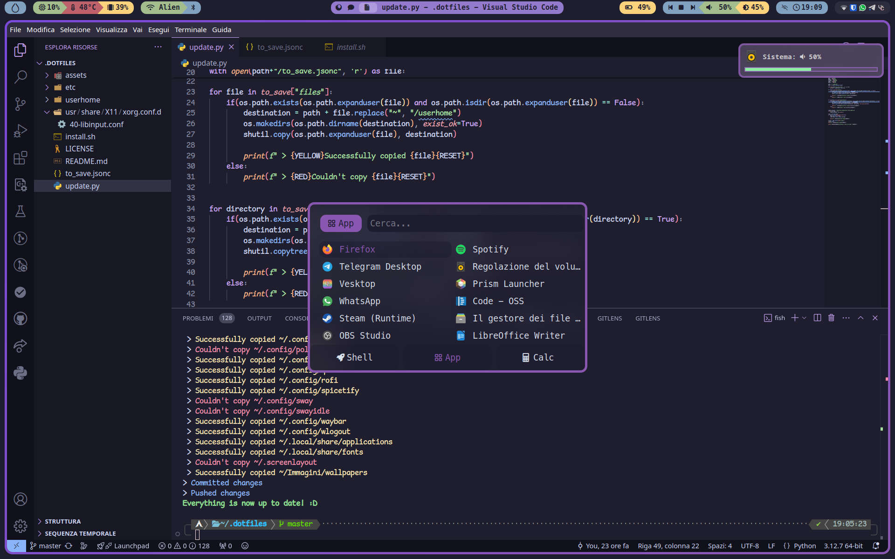
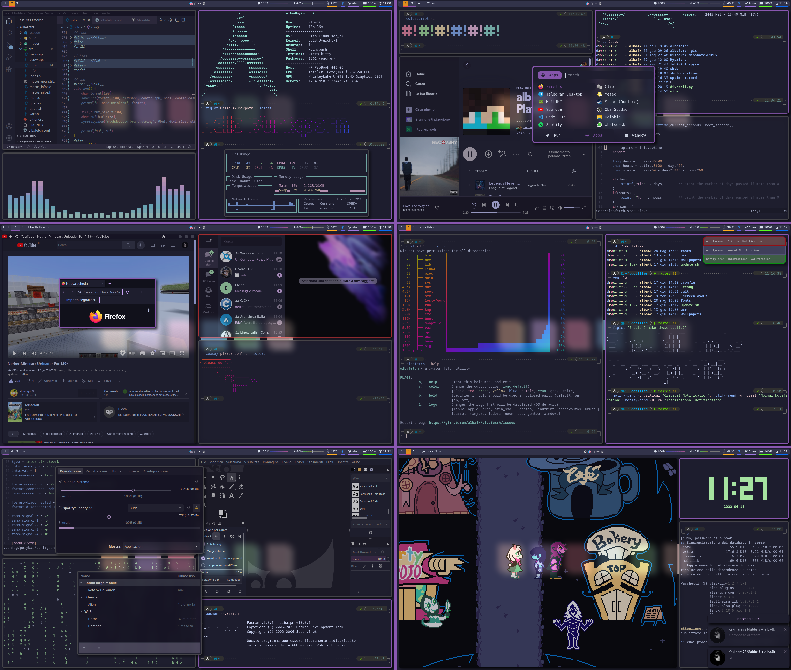

# alba4k's dotfiles



<details>

<summary> A really old picture </summary>



## my dotfiles, shown in [this](https://www.reddit.com/r/unixporn/comments/vf2tej/i3gaps_well_i_like_purple_anybody_here_good_with/) r/unixporn post

</details>

## Usage

My dotfiles live in the `main` branch, you can find them [here](https://github.com/alba4k/dotfiles/tree/main)!

To use them, create an alias like
```sh
alias dotfiles='/usr/bin/git --git-dir=$HOME/.dotfiles.git/ --work-tree=$HOME'
```

and clone them in your home folder using
```
git clone --bare -b main https://github.com/alba4k/dotfiles $HOME/.dotfiles.git
dotfiles read-tree -mu HEAD
dotfiles reset --hard HEAD
dotfiles config --local status.showUntrackedFiles no
```

> [!CAUTION]  
> Only do this if you know what you're doing! You might end up permanently overwriting your existing configuration

---

## I would really like you to **not** just steal my dotflies, take inspiration from them!

### alba4k - 2026

